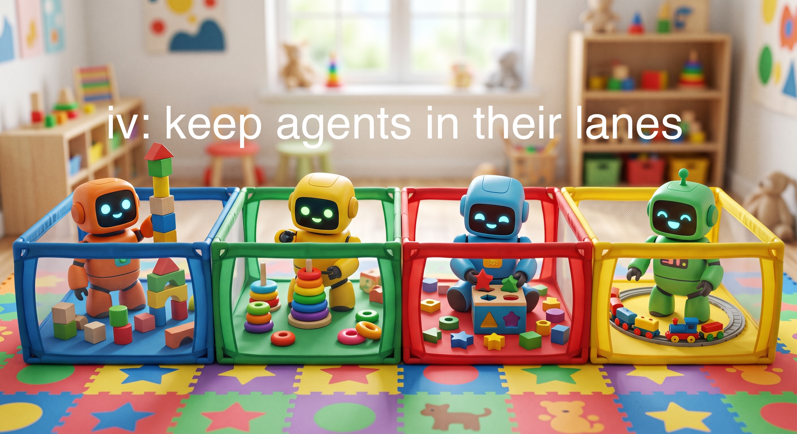

# iv



**Keep agents focused and do replicable data science work.**

`iv` forces code to follow a set of strict guidelines that prevents agents from doing things like handling nulls wrong, constructing dependency cycles, sideloading data, and building on top of stale data.

`iv` is designed for local and bespoke data science work that values correctness and legibility. 

You force your coding agents to generate data according to an `iv` graph, 

## Install

The PyPI name belongs to another project, so install `iv` from GitHub:

```bash
uv add "iv @ git+https://github.com/georgeberry/iv"
# or
pip install "iv @ git+https://github.com/georgeberry/iv"
```

A standard install includes everything: the CLI, Polars/Parquet support, GCS-backed trees
with parallel transfers, preflight linting, graph visualization, and the test toolchain.
There are no install extras or feature-specific installation options.

## Quick start

```python
import polars as pl
from iv import Pipeline

iv = Pipeline(tree="data", project=".", code=["pipeline.py"])

@iv.data(
    dataset="raw/scores/",
    part="season",
    universe=["2024", "2025"],
    why="official season exports",
)
def scores(season):
    return pl.DataFrame({"season": [season], "points": [100]})

@iv.data(
    dataset="processed/features/",
    part="season",
    universe=["2024", "2025"],
    why="score features by season",
)
def features(
    season,
    scores=iv.same_part(scores, why="scores for this season"),
):
    return scores.with_columns((pl.col("points") * 2).alias("points_x2"))
```

Configure the CLI in `pyproject.toml`:

```toml
[tool.iv]
instance = "pipeline:iv"
```

Then run:

```bash
iv preflight
iv run
iv status
```

Roots have no declared inputs and run whenever called. Add `once=True` for a root that
should only be built once. All commits are content-addressed, so unchanged root output
does not move downstream.

## Declarations

- `iv.source(...)` declares a dataset supplied outside the pipeline.
- `@iv.data(...)` declares a stage producing one dataset.
- `iv.dataset(...)` gives a dataset a reusable name or shared schema.
- `@iv.step(output={...})` declares a multi-output stage. With no output, it is an action
  and runs whenever called.

Stage parameters declare reads:

| Selector | Shards selected |
| --- | --- |
| `iv.all_of(data, why=...)` | Every shard |
| `iv.same_part(data, why=...)` | The current output partition |
| `iv.before_part(data, why=..., inclusive=False)` | Earlier partitions |
| `iv.after_part(data, why=..., inclusive=False)` | Later partitions |
| `iv.between(data, why=..., ge=..., lt=...)` | A bounded range |
| `iv.parts(data, why=..., season=[...])` | Explicit partition values |
| `iv.own_last_copy(why=...)` | The stage's previous output for append/update workflows |

Use `optional=True` when no matching shard is valid and `as_paths=True` when the function
needs paths instead of loaded values. `iv.PART` is available inside range bounds.

Set `part="season"` for one shard per call, a tuple for composite partitions, or a mapping
such as `part={"source": "ncaa"}` for a literal shard. `universe=` tells `iv run` which
dynamic partitions to enumerate. `split=True` means one call returns all partitions as a
mapping.

Optionally declare the pipeline's complete partition vocabulary and value contracts:

```python
from iv import Partition

iv = Pipeline(..., partitions={
    "season": Partition(type=int),
    "league": Partition(type=str, choices={"nba", "wnba"}),
})
```

Values remain strings inside stages and shard names, with the existing natural string
ordering. The declared type validates and canonicalizes them (`"02026"` becomes `"2026"`),
and undeclared keys are refused. Give an external dataset a layout with
`iv.source("raw/feed/", why="...", part="season")`; reads then reject old incompatible
shards and `iv gc raw/feed/` can remove them automatically.

Every dynamic stage run through `iv run` needs its own `universe=`. Direct calls and an
explicit `for_each([...])` already name the shards to build and do not need one.

Use `version=` to invalidate a stage deliberately. Use `schema=` on sources or datasets
to enforce an exact ordered Polars schema. Supported stored values are DataFrames
(`.parquet`), JSON-compatible dictionaries/lists (`.json`), picklable values (`.pkl`), and
strings (`.html`). A stage may accept `out` and write its staged file directly.

## CLI

| Command | Purpose |
| --- | --- |
| `iv --instance module:attr COMMAND` | Use a pipeline other than the configured default |
| `iv run` | Run the pipeline in dependency order |
| `iv run --up-to STAGE` | Run a stage and its prerequisites |
| `iv run --up-to-excluding STAGE` | Run only a stage's prerequisites |
| `iv run --from STAGE` | Run a stage and descendants; require current upstreams |
| `iv run --only STAGE` | Run one stage; require current upstreams |
| `iv run --only STAGE --force` | Run despite stale upstreams; does not rebuild them |
| `iv run --only STAGE --dev PATH --force` | Evaluate one stage against production inputs and write locally |
| `iv run --part season=2025` | Filter partitioned work; repeat for composite keys |
| `iv run --log run.log` | Save merged stdout, stderr, and outcomes incrementally |
| `iv fetch PATH` | Download remote production state into a new local directory |
| `iv determinism --only STAGE` | Run a stage twice in isolated temporary output trees and compare content |
| `iv determinism --only STAGE --part season=2025` | Audit one partition of a stage |
| `iv determinism --sample` | Audit every stage at its last declared partition |
| `iv status` | Show current, maybe, and stale shards |
| `iv plan` | Show rebuilds and conditional downstream work |
| `iv why DATASET` | Show shard fingerprints, keys, inputs, and status |
| `iv graph [--focus STAGE] [--full]` | Print the DAG, optionally limited to one stage's cone |
| `iv stage NAME` | Show a stage's reads and writes |
| `iv impact STAGE` | Show what may run if a stage changes |
| `iv impact STAGE --tick` | Show possible impact if all output shards change |
| `iv impact STAGE --tick --tick-part season=2025` | Tick one existing output partition |
| `iv preflight` | Check undefined names, missing modules, and cycles |
| `iv check [--trace FILE]` | Validate declarations and optionally compare a trace |
| `iv drift [--trace FILE]` | Compare code with a recorded run |
| `iv verify [DATASET]` | Re-fingerprint shards and verify their filenames |
| `iv gc [DATASET]` | Remove superseded shards |
| `iv gc DATASET --partition-key season` | Drop shards outside an explicitly named layout |
| `iv viz --out dag.png [--full] [--plain]` | Render the DAG as an image |
| `iv viz --out dag.html --html [--reduce]` | Render an interactive DAG |

## Safety

Within an active stage, reads and writes under the data tree must go through declared
`iv` inputs and outputs. `iv` rejects undeclared I/O, conflicting writers, invalid
partition selectors, missing required shards, schema mismatches, and nested stage calls.

## Development

```bash
uv sync
uv run pytest
uv run python example.py
```

MIT licensed.
